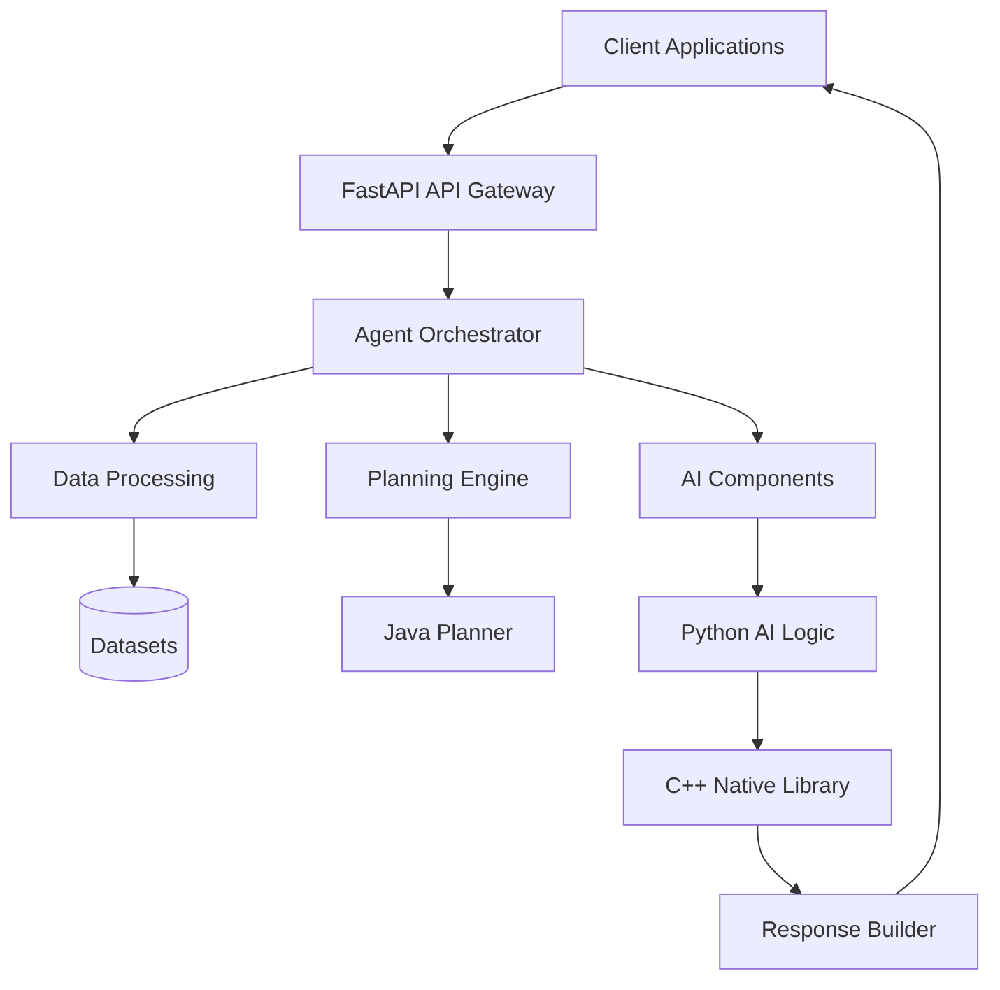
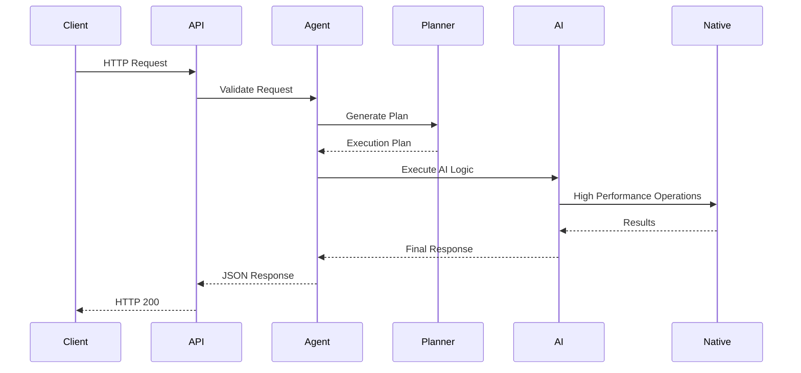
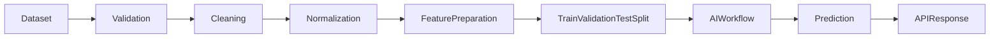
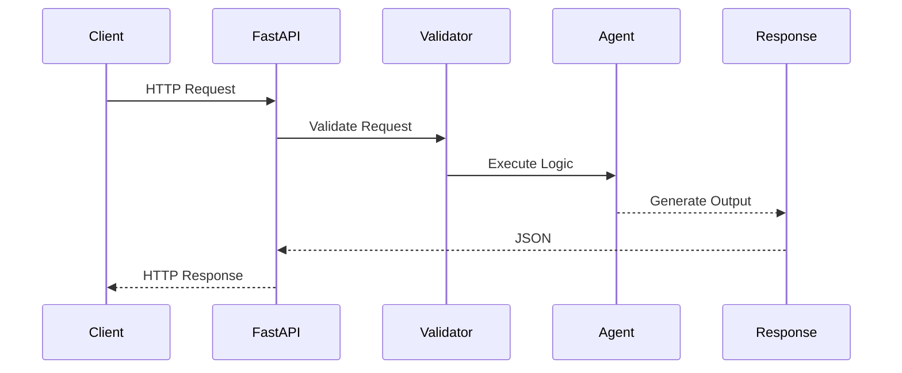

[](https://github.com/CoreyLeath-code/HelixAgent/actions/workflows/ci-cd.yml)
[](https://github.com/CoreyLeath-code/HelixAgent/actions/workflows/security.yml)
[](https://github.com/CoreyLeath-code/HelixAgent/actions/workflows/release.yml)


---
https://helixagent-mzekflcbhda4zdchpyhjum.streamlit.app/

## Enterprise AI Engineering Portfolio Project

HelixAgent is a production-oriented autonomous AI platform designed to demonstrate enterprise software engineering practices for modern AI systems.

Unlike a simple chatbot, HelixAgent combines multiple specialized components—including Python AI orchestration, FastAPI services, Java planning modules, C++ performance libraries, containerized deployment, automated CI/CD, and supply-chain security—into a unified platform that reflects many of the engineering patterns used in production environments.

The project emphasizes:

- 🤖 Multi-Agent AI Architecture
- ⚡ FastAPI Production APIs
- 🧠 LangGraph Agent Orchestration
- ☕ Java Planning Engine
- 🚀 High-Performance C++ Components
- 📦 Multi-stage Docker Deployments
- 🔒 Enterprise Security Automation
- 🧪 Automated Testing & CI/CD
- 📈 Observability & Operational Readiness
- 🏗️ L6 Nine-Tier Deployment Hygiene

---

## Engineering Objectives

HelixAgent is designed to demonstrate practical software engineering skills across multiple disciplines, including:

- AI Engineering
- Backend Engineering
- API Design
- Machine Learning Infrastructure
- DevOps
- MLOps
- Containerization
- Software Architecture
- Secure Software Supply Chains
- CI/CD Automation
- Production Readiness

---

> **Project Goal**
>
> Build an enterprise-style AI platform that emphasizes maintainable architecture, reproducible engineering workflows, security best practices, automated validation, and scalable deployment patterns.

---

# Current Repository Capabilities

✅ FastAPI REST API

✅ Multi-Agent Architecture

✅ Java Planning Module

✅ C++ Performance Components

✅ Dockerized Deployment

✅ Automated CI/CD

✅ Security Scanning

✅ Dependency Auditing

✅ SBOM Generation

✅ CodeQL Analysis

✅ Trivy Vulnerability Scanning

✅ Gitleaks Secret Detection

✅ L6 Deployment Hygiene

---

## Repository Status

| Category | Status |
|-----------|--------|
| Architecture | ✅ Active |
| API | ✅ Active |
| AI Pipeline | ✅ Active |
| Docker | ✅ Production Ready |
| Testing | ✅ Automated |
| CI/CD | ✅ GitHub Actions |
| Security | ✅ Enterprise Scanning |
| Documentation | 🚧 Continuously Improving |
| Release Engineering | ✅ Automated |

---

# Project Philosophy

HelixAgent prioritizes:

✔ Correctness before complexity

✔ Reproducibility before optimization

✔ Security by default

✔ Automated validation

✔ Observable systems

✔ Maintainable architecture

✔ Enterprise deployment practices

✔ Continuous improvement

---

> **Note**
>
> HelixAgent is an engineering portfolio project intended to demonstrate software architecture, AI integration, testing strategies, deployment automation, and production-oriented development practices. While it incorporates patterns commonly used in industry, it is not presented as a drop-in replacement for a commercial AI platform.
>
> # Executive Summary

HelixAgent is a modular AI platform designed to explore how autonomous software agents can be orchestrated using production-oriented engineering practices. Rather than focusing solely on model inference, the project emphasizes the broader lifecycle of building, validating, deploying, and operating AI-powered services.

The system combines a Python-based orchestration layer with a FastAPI service, native performance components, and automated deployment workflows to demonstrate how multiple technologies can work together within a cohesive architecture. It is organized as a collection of interoperable components that can evolve independently while remaining deployable as a unified application.

---

## Design Goals

HelixAgent was built around several engineering objectives:

- Build modular AI services with clear separation of responsibilities.
- Demonstrate reproducible machine learning workflows.
- Apply secure software engineering practices throughout the development lifecycle.
- Support automated validation through testing and continuous integration.
- Use containerized deployments that are consistent across development and production environments.
- Document architectural decisions and operational considerations clearly.

---

## Core Capabilities

HelixAgent currently includes capabilities such as:

- AI workflow orchestration
- FastAPI REST endpoints
- Modular agent architecture
- Data ingestion and preprocessing
- Reproducible dataset partitioning
- Containerized deployment
- Automated CI/CD validation
- Static code analysis
- Dependency auditing
- Secret scanning
- Software Bill of Materials (SBOM) generation
- Automated release engineering
- Production-style documentation

---

## High-Level Architecture

At a high level, HelixAgent follows a layered architecture:

```text
                Client Applications
                        │
                        ▼
                 FastAPI REST API
                        │
                        ▼
               Agent Orchestration Layer
        ┌───────────────┼───────────────┐
        ▼               ▼               ▼
   AI Components   Planning Logic   Data Services
        │               │               │
        └───────────────┼───────────────┘
                        ▼
          Validation, Logging, Metrics
                        │
                        ▼
         Docker • GitHub Actions • Security
```

Each layer has a clearly defined responsibility, making the platform easier to understand, test, and extend.

---

## Engineering Principles

Several principles guided the implementation:

### Separation of Concerns

Each subsystem is responsible for a single area of functionality. API routing, business logic, data processing, and infrastructure concerns are intentionally separated to reduce coupling and improve maintainability.

---

### Reproducibility

Machine learning workflows should produce consistent results when given the same inputs. Deterministic dataset partitioning, explicit dependency management, and automated validation help support reproducible development.

---

### Secure by Default

Security considerations are incorporated into the engineering workflow rather than treated as a final step. Automated scanning, dependency auditing, and supply-chain documentation help identify issues early in the development lifecycle.

---

### Automation First

Routine engineering tasks—including testing, formatting, vulnerability scanning, and release preparation—are automated through GitHub Actions to reduce manual effort and improve consistency.

---

### Operational Readiness

The project includes health checks, containerized deployment, release automation, and engineering documentation that reflect operational concerns beyond writing application code.

---

## Intended Audience

HelixAgent is intended for readers who are interested in:

- Software Engineering
- AI Engineering
- Machine Learning Infrastructure
- MLOps
- Backend Development
- DevOps
- Cloud-Native Applications
- Secure Software Supply Chains

The repository is designed to illustrate engineering practices and architectural thinking rather than to serve as a finished commercial product.

---

## Repository Scope

This project demonstrates how modern AI applications can be organized using modular software engineering practices. It emphasizes code quality, testing, deployment automation, documentation, and maintainability alongside AI functionality.

As the project evolves, additional capabilities may be incorporated, but new features will continue to prioritize architectural clarity, reproducibility, and operational reliability.

# Why HelixAgent?

Many AI demonstrations focus on generating responses from a language model. While that showcases model capabilities, production AI systems require significantly more engineering than model inference alone.

HelixAgent was created to explore the broader software engineering challenges involved in designing, validating, deploying, and maintaining AI-powered applications.

The project intentionally emphasizes architecture, automation, reproducibility, security, and operational readiness alongside AI functionality.

---

# Engineering Motivation

Modern AI applications are composed of many interconnected systems rather than a single model.

Typical production environments include:

- API gateways
- orchestration layers
- data pipelines
- model services
- deployment infrastructure
- monitoring
- logging
- security validation
- automated testing
- release automation

HelixAgent was designed to integrate these engineering concerns into a single repository while keeping components modular and maintainable.

---

# Why Build HelixAgent?

The primary goals of the project are to demonstrate:

- Software architecture
- AI application design
- Backend engineering
- API development
- CI/CD automation
- Containerized deployment
- Testing strategy
- Supply-chain security
- Engineering documentation
- Production-oriented development practices

Rather than optimizing for the shortest implementation, the repository prioritizes clarity, maintainability, and extensibility.

---

# Why FastAPI?

FastAPI provides several characteristics that align well with modern backend development:

- automatic OpenAPI documentation
- request validation through Pydantic
- asynchronous request handling
- strong type annotations
- high performance
- clear API contracts

These capabilities make it well suited for exposing AI services through well-defined REST interfaces.

---

# Why Python?

Python serves as the orchestration language because it provides mature ecosystems for:

- machine learning
- natural language processing
- data engineering
- backend APIs
- scientific computing
- automation

Its broad library support makes it an effective choice for coordinating AI workflows.

---

# Why Java?

The Java planning module demonstrates that enterprise systems frequently integrate services written in multiple languages.

Using Java illustrates concepts such as:

- language interoperability
- service isolation
- modular architecture
- independently deployable components

This reflects how many production environments evolve over time rather than assuming a single-language codebase.

---

# Why C++?

Performance-sensitive workloads sometimes benefit from native implementations.

Including a C++ component demonstrates:

- interoperability between native and managed code
- performance-oriented programming
- modular native libraries
- language boundary integration

Its purpose within HelixAgent is educational and architectural rather than simply increasing language count.

---

# Why Docker?

Containerization provides consistent execution across environments.

Using Docker allows the project to:

- package dependencies
- simplify deployment
- isolate runtime environments
- improve reproducibility
- reduce environment-specific configuration issues

The repository uses multi-stage builds to separate build dependencies from runtime dependencies and reduce the size of the final image.

---

# Why Automated Testing?

Software changes should be validated automatically whenever possible.

HelixAgent includes automated tests to help verify:

- expected functionality
- edge cases
- regression prevention
- API behavior
- deterministic data processing

Automated validation increases confidence when introducing new features or refactoring existing code.

---

# Why CI/CD?

Continuous Integration helps ensure that code is evaluated consistently before being merged.

Automated workflows perform tasks such as:

- syntax validation
- static analysis
- unit testing
- coverage reporting
- container builds
- security scanning

This reduces manual effort while providing repeatable validation.

---

# Why Security Automation?

Modern software engineering includes security throughout the development lifecycle rather than treating it as a separate phase.

HelixAgent incorporates automated security tooling such as:

- CodeQL
- Trivy
- Gitleaks
- pip-audit
- Dependabot
- CycloneDX SBOM generation

These tools provide additional visibility into source code, dependencies, and container images.

---

# Why Reproducibility Matters

Reproducibility is particularly important in machine learning systems.

Examples include:

- deterministic dataset partitioning
- explicit dependency versions
- automated validation
- containerized execution
- documented deployment procedures

These practices help reduce variability between development, testing, and deployment environments.

---

# Why Documentation?

Well-structured documentation improves maintainability by making engineering decisions understandable to future contributors.

The repository includes documentation for:

- architecture
- deployment
- testing
- CI/CD
- security
- contribution workflow
- release process

Good documentation complements source code by explaining design intent in addition to implementation details.

---

# Project Philosophy

HelixAgent is guided by several engineering principles.

## Build Modular Systems

Components should have clearly defined responsibilities and minimal coupling.

---

## Automate Repetitive Work

Testing, validation, formatting, and release preparation should be handled automatically whenever practical.

---

## Prefer Maintainability

Readable, well-organized code is generally easier to evolve than highly optimized but difficult-to-understand implementations.

---

## Treat Security as a Continuous Process

Security validation should be integrated into development workflows rather than performed only before release.

---

## Design for Evolution

Software requirements change over time.

The architecture favors modularity so individual components can be replaced or extended without requiring large-scale redesign.

---

# Long-Term Vision

The long-term objective is to continue evolving HelixAgent into a richer engineering platform for experimenting with AI workflows, deployment strategies, observability, and scalable software architecture.

Future enhancements will continue to prioritize engineering quality, reproducibility, operational reliability, and maintainable system design.

# Core Features

HelixAgent combines AI orchestration, backend engineering, deployment automation, and production-oriented software engineering practices into a single modular platform.

---

# AI Platform

### Multi-Agent Architecture

The platform is organized into modular components that can evolve independently while working together through clearly defined interfaces.

### AI Workflow Orchestration

Coordinates AI-related processing through a structured backend architecture that separates API routing, orchestration logic, and supporting services.

### Extensible Agent Design

The architecture is intended to support additional specialized agents without requiring major changes to the surrounding infrastructure.

---

# Backend Engineering

### FastAPI REST API

Provides a typed REST interface for interacting with HelixAgent.

Features include:

- Request validation
- Structured JSON responses
- Automatic OpenAPI documentation
- Async request handling
- Health endpoints

---

### Modular Architecture

The project separates responsibilities across multiple layers including:

- API
- Core business logic
- Data ingestion
- Utilities
- Native libraries
- Testing

This organization improves maintainability and reduces coupling.

---

### Production Configuration

Configuration is centralized to improve consistency across development, testing, and deployment environments.

---

# Data Pipeline

### Dataset Loading

Supports structured dataset ingestion from CSV files.

---

### Data Validation

Input validation includes:

- Missing file detection
- Empty dataset detection
- File-type validation
- Duplicate column detection
- Invalid parameter detection

---

### Data Preprocessing

Preprocessing utilities normalize incoming datasets before downstream processing.

Examples include:

- Header normalization
- Null-value removal
- Data validation

---

### Deterministic Dataset Splits

Training, validation, and testing datasets are generated using deterministic random seeds to improve experiment reproducibility.

---

# Cross-Language Engineering

HelixAgent demonstrates interoperability between multiple programming languages.

Current architecture includes:

- Python
- Java
- C++

Each component focuses on a specific engineering responsibility while remaining independently maintainable.

---

# Containerization

The repository includes containerized deployment using Docker.

Current deployment features include:

- Multi-stage builds
- Non-root runtime
- Health checks
- Minimal runtime image
- Reproducible environments

---

# CI/CD

Automated workflows validate changes before integration.

Current pipeline includes:

- Python compatibility matrix
- Automated testing
- Static analysis
- Coverage reports
- Artifact generation
- Release validation

---

# Security Engineering

The repository incorporates several automated security controls.

Current implementation includes:

- CodeQL
- Trivy
- Gitleaks
- pip-audit
- Dependabot
- CycloneDX SBOM generation

These tools help identify security and dependency issues throughout development.

---

# Testing

Testing focuses on validating both expected behavior and common failure scenarios.

Current test coverage includes:

- API contract validation
- Data-ingestion validation
- Edge cases
- Invalid inputs
- Deterministic processing
- Regression prevention

---

# Release Engineering

Release automation supports consistent packaging and versioning.

Current capabilities include:

- GitHub Releases
- Semantic version tags
- Release artifacts
- Container publishing
- Release-readiness validation

---

# Documentation

The repository includes engineering documentation covering:

- Architecture
- Deployment
- Testing
- Security
- Contribution workflow
- Changelog
- Release process
- L6 Deployment Hygiene

---

# Operational Readiness

Operational considerations are incorporated alongside application development.

Examples include:

- Health endpoints
- Container validation
- Automated builds
- Deployment verification
- Governance documentation

---

# Highlights

| Capability | Status |
|------------|--------|
| FastAPI API | ✅ |
| AI Agent Architecture | ✅ |
| Modular Design | ✅ |
| CSV Data Ingestion | ✅ |
| Dataset Validation | ✅ |
| Deterministic Data Splits | ✅ |
| Python Unit Tests | ✅ |
| API Contract Tests | ✅ |
| Docker Deployment | ✅ |
| Multi-stage Container | ✅ |
| Non-root Runtime | ✅ |
| GitHub Actions CI | ✅ |
| CodeQL Analysis | ✅ |
| Trivy Security Scan | ✅ |
| Gitleaks Secret Scan | ✅ |
| Dependency Auditing | ✅ |
| SBOM Generation | ✅ |
| Dependabot | ✅ |
| Release Automation | ✅ |
| L6 Nine-Tier Deployment Hygiene | ✅ |

---

# Engineering Priorities

The project emphasizes:

- Maintainable software architecture
- Reproducible engineering workflows
- Automated quality validation
- Security throughout the development lifecycle
- Clear documentation
- Modular design
- Operational readiness
- Continuous improvement

- # Technology Stack

HelixAgent is intentionally built using multiple technologies to demonstrate how different components can collaborate within a modular software architecture.

Rather than relying on a single framework, the project combines backend APIs, AI tooling, native libraries, containerization, testing infrastructure, and deployment automation into a cohesive engineering platform.

---

# Technology Overview

| Category | Technologies |
|------------|--------------|
| Programming Languages | Python • Java • C++ |
| AI Frameworks | LangGraph • OpenAI SDK • Transformers *(where applicable)* |
| Machine Learning | Scikit-learn • Pandas • NumPy |
| Backend API | FastAPI • Uvicorn • Pydantic |
| Containerization | Docker |
| CI/CD | GitHub Actions |
| Security | CodeQL • Trivy • Gitleaks • pip-audit |
| Supply Chain | CycloneDX SBOM • Dependabot |
| Testing | Pytest • Coverage • JUnit Reports |
| Documentation | Markdown • Mermaid Diagrams |
| Version Control | Git • GitHub |

---

# Programming Languages

## Python

Python serves as the primary orchestration language throughout HelixAgent.

It is responsible for:

- AI orchestration
- FastAPI services
- Data ingestion
- Machine learning workflows
- Automation
- Testing
- Deployment utilities

Python provides access to mature AI and data engineering ecosystems while supporting rapid development.

---

## Java

Java demonstrates enterprise interoperability.

Within the project it is used to illustrate:

- modular planning components
- independent service logic
- language interoperability
- enterprise software patterns

Separating planning functionality into its own language emphasizes component isolation rather than assuming a single-language architecture.

---

## C++

C++ is included to demonstrate integration with native performance-oriented libraries.

Potential responsibilities include:

- vector operations
- numerical computation
- performance-sensitive algorithms
- native interoperability

The focus is architectural integration rather than maximizing language count.

---

# Backend Framework

## FastAPI

FastAPI powers the primary REST API.

Reasons for selecting FastAPI include:

- asynchronous request handling
- automatic OpenAPI documentation
- request validation
- strong typing
- high performance
- excellent developer experience

---

## Uvicorn

Uvicorn provides the ASGI server used to host the FastAPI application.

Benefits include:

- lightweight runtime
- asynchronous execution
- production deployment compatibility

---

## Pydantic

Pydantic validates request and response models.

Benefits include:

- automatic validation
- structured error reporting
- typed models
- API consistency

---

# AI & Machine Learning

## Scikit-learn

Used for:

- deterministic dataset partitioning
- preprocessing
- reproducible workflows

---

## Pandas

Responsible for:

- dataset loading
- preprocessing
- validation
- tabular transformations

---

## NumPy

Supports numerical computation throughout preprocessing and machine learning workflows.

---

## LangGraph

LangGraph enables structured orchestration of AI workflows by modeling interactions as explicit graphs rather than ad hoc function calls.

This approach makes workflows easier to reason about, extend, and test.

---

# Containerization

## Docker

Docker provides a consistent runtime across development and deployment environments.

Current deployment includes:

- multi-stage builds
- isolated runtime
- non-root execution
- health checks
- reproducible environments

---

# Continuous Integration

## GitHub Actions

GitHub Actions automates repository validation.

Current workflows include:

- multi-version testing
- static analysis
- coverage generation
- container validation
- security scanning
- release automation

---

# Security Tooling

Security automation is integrated directly into the engineering workflow.

## CodeQL

Performs static analysis to identify potential correctness and security issues.

---

## Trivy

Scans repository contents and container images for known vulnerabilities.

---

## Gitleaks

Detects accidentally committed credentials or secrets before release.

---

## pip-audit

Audits Python dependencies against known vulnerability databases.

---

## Dependabot

Keeps dependencies up to date by proposing automated updates for supported ecosystems.

---

## CycloneDX SBOM

Generates a Software Bill of Materials documenting runtime dependencies to improve supply-chain visibility.

---

# Testing Stack

HelixAgent emphasizes automated validation.

Current testing tools include:

| Tool | Purpose |
|--------|----------|
| Pytest | Unit and integration testing |
| Coverage.py | Code coverage reporting |
| JUnit XML | CI test artifacts |
| Ruff | Static correctness checks |

---

# Development Environment

Recommended development environment:

| Component | Recommendation |
|------------|----------------|
| Operating System | Windows 11, Linux, or macOS |
| Python | 3.10+ |
| Java | JDK 17+ |
| C++ Compiler | GCC or Clang |
| IDE | Visual Studio Code |
| Version Control | Git |
| Containers | Docker Desktop |

---

# Architecture Layers

```text
┌───────────────────────────────────────┐
│           Client Applications         │
└───────────────────────────────────────┘
                  │
                  ▼
┌───────────────────────────────────────┐
│            FastAPI Gateway            │
└───────────────────────────────────────┘
                  │
                  ▼
┌───────────────────────────────────────┐
│        AI Orchestration Layer         │
└───────────────────────────────────────┘
         │             │
         ▼             ▼
┌──────────────┐ ┌──────────────┐
│ Java Planner │ │ Python Agents│
└──────────────┘ └──────────────┘
         │             │
         └──────┬──────┘
                ▼
      ┌──────────────────┐
      │ C++ Components   │
      └──────────────────┘
                │
                ▼
┌───────────────────────────────────────┐
│ Testing • Security • CI/CD • Docker   │
└───────────────────────────────────────┘
```

---

# Engineering Philosophy

Technology selection in HelixAgent is driven by engineering goals rather than novelty.

Key considerations include:

- maintainability
- modularity
- reproducibility
- security
- automation
- interoperability
- operational readiness

Each technology is included because it contributes to a specific architectural responsibility within the project rather than simply expanding the list of tools used.

# System Architecture

HelixAgent follows a layered architecture that separates client interaction, API routing, orchestration, processing, and operational infrastructure.

Each layer has a clearly defined responsibility, making the platform easier to maintain, extend, test, and deploy.

---

# High-Level Architecture



---

# Layered System Design

```text
┌────────────────────────────────────┐
│ Client Applications                │
└────────────────────────────────────┘
                 │
                 ▼
┌────────────────────────────────────┐
│ FastAPI REST API                   │
└────────────────────────────────────┘
                 │
                 ▼
┌────────────────────────────────────┐
│ Agent Orchestration Layer          │
└────────────────────────────────────┘
      │           │            │
      ▼           ▼            ▼
 Data Layer   AI Engine    Planner
      │           │            │
      └───────────┼────────────┘
                  ▼
      Native Performance Layer
                  │
                  ▼
         Response Generation
```

---

# Request Lifecycle

Every request follows a predictable processing pipeline.



---

# Component Responsibilities

| Component | Responsibility |
|------------|----------------|
| FastAPI | HTTP API and request validation |
| Agent Layer | Workflow coordination |
| Data Layer | Dataset ingestion and preprocessing |
| AI Layer | AI workflow execution |
| Java Planner | Planning and orchestration logic |
| C++ Library | Performance-sensitive computation |
| Docker | Runtime packaging |
| GitHub Actions | Automated validation |
| Security Pipeline | Static analysis and dependency validation |

---

# Data Flow



---

# Agent Processing Pipeline

```mermaid
flowchart TD

Prompt

↓

Input Validation

↓

Agent Router

↓

Planning

↓

Execution

↓

Native Processing

↓

Result Aggregation

↓

API Response
```

---

# Deployment Architecture

```mermaid
flowchart TD

Developer

↓

GitHub Repository

↓

GitHub Actions

↓

Quality Gates

↓

Security Pipeline

↓

Docker Build

↓

Release Validation

↓

GitHub Release

↓

Container Deployment
```

---

# Continuous Integration Pipeline

```mermaid
flowchart LR

Commit

-->

Pull Request

-->

Python Matrix

-->

Unit Tests

-->

API Tests

-->

Coverage

-->

Ruff

-->

CodeQL

-->

Trivy

-->

Gitleaks

-->

SBOM

-->

Release Ready
```

---

# Security Architecture

```mermaid
flowchart TD

Source Code

↓

CodeQL

↓

Dependency Audit

↓

Gitleaks

↓

Trivy

↓

SBOM

↓

Security Review

↓

Deployment
```

---

# Container Architecture

```mermaid
flowchart TD

Python Builder

↓

Dependencies Installed

↓

Java Builder

↓

Planner

↓

C++ Builder

↓

Native Library

↓

Runtime Image

↓

Non-Root User

↓

Health Check

↓

FastAPI
```

---

# Repository Organization

```text
HelixAgent

├── api/
│   ├── FastAPI Services
│   └── API Routes
│
├── agent/
│   ├── Python Agents
│   ├── Java Planner
│   └── C++ Components
│
├── src/
│   ├── Data Processing
│   ├── Utilities
│   └── Core Logic
│
├── tests/
│   ├── API Tests
│   ├── Data Tests
│   └── Unit Tests
│
├── docs/
│   ├── Deployment
│   ├── L6 Hygiene
│   └── Architecture
│
└── .github/
    ├── CI
    ├── Security
    └── Release
```

---

# Design Principles

The architecture follows several engineering principles:

- Clear separation of responsibilities
- Modular component boundaries
- Explicit API contracts
- Reproducible execution
- Automated validation
- Containerized deployment
- Defense-in-depth security
- Incremental extensibility

Each subsystem is designed to evolve independently while maintaining well-defined interfaces with the rest of the platform. This approach helps reduce coupling, improves testability, and makes future enhancements easier to integrate.

# Project Structure

HelixAgent follows a modular repository layout that separates API services, AI orchestration, native components, infrastructure, testing, and documentation into well-defined directories.

This organization improves maintainability, simplifies navigation, and makes it easier to evolve individual subsystems without tightly coupling unrelated functionality.

---

# Repository Layout

```text
HelixAgent
│
├── .github/
│   ├── workflows/
│   │   ├── ci-cd.yml
│   │   ├── security.yml
│   │   └── release.yml
│   │
│   ├── dependabot.yml
│   └── pull_request_template.md
│
├── api/
│   ├── main.py
│   ├── routes/
│   ├── schemas/
│   ├── middleware/
│   └── services/
│
├── agent/
│   ├── python/
│   ├── java/
│   └── cpp/
│
├── src/
│   ├── core/
│   ├── data/
│   ├── models/
│   ├── utils/
│   ├── services/
│   └── data_ingest.py
│
├── tests/
│   ├── test_api.py
│   ├── test_data_ingest.py
│   ├── fixtures/
│   └── integration/
│
├── docs/
│   ├── L6_DEPLOYMENT_HYGIENE.md
│   ├── architecture.md
│   └── deployment.md
│
├── Dockerfile
├── requirements.txt
├── requirements-dev.txt
├── README.md
├── CHANGELOG.md
├── CONTRIBUTING.md
├── SECURITY.md
└── LICENSE
```

---

# Directory Overview

---

## `.github/`

Contains repository automation.

Responsibilities include:

- Continuous Integration
- Security Scanning
- Release Automation
- Dependabot
- Pull Request Templates

This directory defines the automated engineering workflow used to validate every contribution.

---

## `api/`

Implements the REST API exposed by HelixAgent.

Typical responsibilities include:

- FastAPI application
- Routing
- Request validation
- Response serialization
- HTTP middleware
- API configuration

This layer represents the public interface to the platform.

---

## `agent/`

Contains agent-related components.

Examples include:

- Python orchestration
- Java planning logic
- C++ native libraries

Separating these components emphasizes modularity and language interoperability.

---

## `src/`

Contains the primary application logic.

Examples include:

- business logic
- AI workflow coordination
- preprocessing
- utilities
- shared services

This directory intentionally avoids HTTP-specific concerns.

---

## `tests/`

Contains automated validation.

Testing categories include:

- Unit Tests
- API Tests
- Edge Cases
- Regression Tests
- Data Validation

The goal is to validate behavior rather than implementation details.

---

## `docs/`

Contains engineering documentation.

Documentation includes:

- deployment
- architecture
- contribution guidelines
- operational procedures
- L6 Deployment Hygiene

Keeping documentation version-controlled alongside the codebase helps ensure it evolves with the project.

---

# Layer Responsibilities

| Layer | Responsibility |
|---------|----------------|
| API | HTTP communication |
| Core | Business logic |
| Data | Dataset processing |
| Agent | AI orchestration |
| Utilities | Shared reusable functionality |
| Tests | Validation |
| Docs | Engineering documentation |
| GitHub | Automation |

---

# Dependency Direction

Dependencies intentionally flow inward.

```text
API

↓

Business Logic

↓

Data Processing

↓

Utilities

↓

Native Libraries
```

Higher-level layers depend on lower-level abstractions.

Lower-level layers do **not** depend on API routing or presentation logic.

This reduces coupling and improves maintainability.

---

# Design Philosophy

Each directory exists for a specific reason.

The repository avoids placing unrelated functionality into the same location.

Instead it groups code according to responsibility.

Examples include:

- API concerns stay inside `api/`
- preprocessing stays inside `src/`
- infrastructure remains inside `.github/`
- documentation remains inside `docs/`
- tests remain isolated inside `tests/`

This organization makes the project easier to understand for both new contributors and future maintainers.

---

# Naming Conventions

The repository follows consistent naming practices.

### Python

- snake_case for files
- PascalCase for classes
- lowercase package names
- descriptive module names

---

### Java

- PascalCase classes
- camelCase methods
- package-based organization

---

### C++

- descriptive filenames
- header/source separation where appropriate
- minimal external dependencies

---

### Git

Branch names follow feature-oriented conventions.

Examples:

```text
feature/api-health-check

feature/model-improvements

fix/docker-healthcheck

refactor/data-ingestion

docs/l6-readme
```

Commit messages use Conventional Commits whenever practical.

Examples:

```text
feat:

fix:

refactor:

test:

docs:

build:

ci:

perf:

chore:
```

---

# Repository Organization Goals

The repository structure is designed to support:

- readability
- maintainability
- modularity
- scalability
- automated testing
- reproducible builds
- production deployments

As HelixAgent grows, new functionality should be added by extending existing layers rather than creating tightly coupled modules or duplicating logic.

This approach helps keep the project approachable while supporting future expansion.

# Installation & Quick Start

This guide walks through setting up HelixAgent for local development, testing, and containerized execution.

---

# Prerequisites

Before getting started, ensure the following tools are installed.

| Software | Recommended Version |
|-----------|---------------------|
| Git | Latest |
| Python | 3.10 or newer |
| Java JDK | 17+ |
| GCC / Clang | C++17 compatible |
| Docker Desktop | Latest |
| Visual Studio Code | Latest |

---

# Clone the Repository

```bash
git clone https://github.com/CoreyLeath-code/HelixAgent.git

cd HelixAgent
```

---

# Create a Python Virtual Environment

### Windows

```powershell
python -m venv .venv

.venv\Scripts\activate
```

### Linux / macOS

```bash
python3 -m venv .venv

source .venv/bin/activate
```

---

# Upgrade pip

```bash
python -m pip install --upgrade pip
```

---

# Install Dependencies

Runtime dependencies:

```bash
pip install -r requirements.txt
```

Development dependencies:

```bash
pip install -r requirements-dev.txt
```

---

# Verify Installation

```bash
python --version

pip --version
```

Expected output:

```text
Python 3.11.x

pip 24.x.x
```

---

# Configure Environment Variables

If your deployment uses environment variables, create a local configuration file.

```bash
cp .env.example .env
```

Example configuration:

```text
API_HOST=0.0.0.0

API_PORT=8000

LOG_LEVEL=INFO

ENVIRONMENT=development
```

Never commit `.env` files containing credentials.

---

# Running the FastAPI Server

Start the API locally:

```bash
uvicorn api.main:app --reload
```

The API should now be available at

```
http://localhost:8000
```

---

# OpenAPI Documentation

Interactive documentation:

```
http://localhost:8000/docs
```

Alternative OpenAPI UI:

```
http://localhost:8000/redoc
```

---

# Verify the Health Endpoint

```bash
curl http://localhost:8000/health
```

Expected response:

```json
{
  "status": "healthy",
  "version": "1.0.0"
}
```

---

# Example API Request

```bash
curl -X POST \
http://localhost:8000/predict \
-H "Content-Type: application/json" \
-d '{
      "prompt":"Summarize the current system status."
}'
```

Example response:

```json
{
  "result":"..."
}
```

The exact response depends on the configured backend implementation.

---

# Running the Test Suite

Execute the complete Python test suite.

```bash
pytest tests -v
```

Run with coverage:

```bash
pytest tests \
--cov=api \
--cov=src \
--cov-report=term-missing \
--cov-report=html
```

Coverage reports are generated locally and, in CI, uploaded as artifacts.

---

# Static Analysis

Run Ruff:

```bash
ruff check api agent src tests
```

Compile all Python modules:

```bash
python -m compileall api agent src tests
```

---

# Build the Docker Image

```bash
docker build -t helixagent .
```

---

# Run the Container

```bash
docker run \
-p 8000:8000 \
helixagent
```

---

# Verify Container Health

```bash
curl http://localhost:8000/health
```

The configured health endpoint should report that the service is ready to receive requests.

---

# Local Development Workflow

Typical development cycle:

```text
Create Feature Branch

↓

Implement Change

↓

Run Ruff

↓

Run Tests

↓

Build Docker Image

↓

Open Pull Request

↓

GitHub Actions

↓

Merge
```

---

# GitHub Actions Validation

Every pull request is automatically validated using:

- Python compatibility matrix
- Unit tests
- API contract tests
- Coverage reports
- Ruff correctness checks
- Container build verification
- Security scanning
- Release-readiness validation

Contributors should aim to reproduce these checks locally before opening a pull request.

---

# Recommended VS Code Extensions

Recommended extensions include:

- Python
- Pylance
- Docker
- GitHub Actions
- GitLens
- Markdown All in One
- YAML
- Better Comments

---

# Troubleshooting

## Virtual Environment Not Activated

Symptoms:

```text
ModuleNotFoundError
```

Solution:

Activate the virtual environment before installing or running dependencies.

---

## Missing Dependencies

Symptoms:

```text
ImportError
```

Solution:

```bash
pip install -r requirements-dev.txt
```

---

## Docker Build Fails

Verify Docker is running:

```bash
docker info
```

Rebuild without cache:

```bash
docker build --no-cache -t helixagent .
```

---

## Port Already in Use

Run on another port:

```bash
uvicorn api.main:app --reload --port 8080
```

or

```bash
docker run -p 8080:8000 helixagent
```

---

# Development Best Practices

Before opening a pull request:

- Run the complete test suite.
- Run Ruff and resolve correctness issues.
- Verify the application starts successfully.
- Build the Docker image.
- Review documentation for any required updates.
- Ensure new behavior is covered by tests.
- Confirm no credentials or sensitive files are included in the commit.

Following these steps helps keep the repository stable and makes code review more efficient.

# REST API Documentation

HelixAgent exposes a REST API built with FastAPI.

The API is designed around predictable request validation, structured JSON responses, and clear error handling.

---

# API Overview

| Method | Endpoint | Description |
|----------|----------|-------------|
| GET | `/` | API status |
| GET | `/health` | Health check |
| POST | `/predict` | Execute an AI inference request |

---

# Base URL

Local Development

```
http://localhost:8000
```

Docker

```
http://localhost:8000
```

---

# OpenAPI Documentation

FastAPI automatically generates interactive API documentation.

Swagger UI

```
http://localhost:8000/docs
```

ReDoc

```
http://localhost:8000/redoc
```

---

# API Request Flow



---

# GET /

Returns the current API status.

## Request

```http
GET /
```

---

## Example Response

```json
{
  "status": "ok",
  "service": "HelixAgent"
}
```

---

## Success Codes

| Code | Description |
|------|-------------|
| 200 | API available |

---

# GET /health

Returns the application health status.

This endpoint is intended for:

- Docker health checks
- Kubernetes probes
- Load balancers
- Monitoring systems

---

## Request

```http
GET /health
```

---

## Example Response

```json
{
    "status":"healthy",
    "version":"1.0.0"
}
```

---

## Success Codes

| Code | Meaning |
|------|----------|
| 200 | Healthy |

---

# POST /predict

Executes an AI workflow using the supplied prompt.

---

## Request

```http
POST /predict
```

---

## Headers

```http
Content-Type: application/json
```

---

## Example Request

```json
{
    "prompt":"Summarize the system status."
}
```

---

## Example Response

```json
{
    "result":"System summary..."
}
```

The exact response depends on the configured AI workflow.

---

# Request Validation

HelixAgent validates incoming requests before they reach the business logic.

Validation includes:

- Required fields
- JSON structure
- Data types
- Invalid payload detection

Invalid requests receive a structured HTTP error response.

---

## Example Validation Error

```json
{
    "detail":[
        {
            "loc":["body","prompt"],
            "msg":"field required",
            "type":"value_error.missing"
        }
    ]
}
```

---

# HTTP Status Codes

| Code | Meaning |
|------|----------|
| 200 | Success |
| 400 | Bad Request |
| 404 | Endpoint Not Found |
| 422 | Validation Failed |
| 500 | Internal Server Error |

---

# Response Format

Successful responses follow a consistent JSON structure.

Example:

```json
{
    "result":"..."
}
```

Health responses:

```json
{
    "status":"healthy",
    "version":"1.0.0"
}
```

Status responses:

```json
{
    "status":"ok",
    "service":"HelixAgent"
}
```

---

# Error Handling Philosophy

HelixAgent follows several API design principles.

- Return appropriate HTTP status codes.
- Validate requests before executing business logic.
- Use structured JSON responses.
- Avoid exposing sensitive implementation details.
- Provide clear validation feedback.

---

# Request Lifecycle

```mermaid
flowchart TD

Request

↓

Routing

↓

Validation

↓

Agent

↓

Processing

↓

Response Serialization

↓

HTTP Response
```

---

# API Security

The API benefits from the repository's broader engineering controls.

Current controls include:

- CodeQL static analysis
- Gitleaks secret scanning
- Trivy vulnerability scanning
- Dependency auditing
- SBOM generation
- Automated CI validation

These controls help improve software quality but are separate from runtime authentication or authorization mechanisms.

---

# Future API Enhancements

Potential future additions include:

- Authentication
- Authorization
- API versioning
- Rate limiting
- Request tracing
- Streaming responses
- Background tasks
- WebSocket endpoints
- OpenTelemetry instrumentation
- Distributed agent execution

---

# API Design Goals

The API is designed to emphasize:

- Simplicity
- Predictable behavior
- Strong validation
- Clear documentation
- Maintainability
- Extensibility

As HelixAgent evolves, new endpoints will follow the same conventions to maintain a consistent developer experience.
