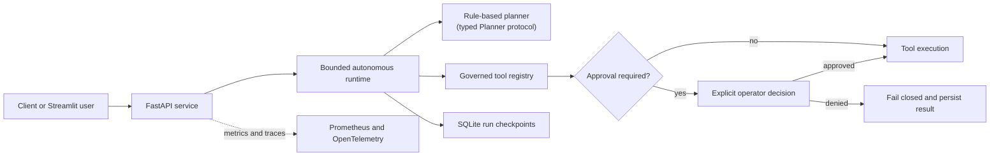
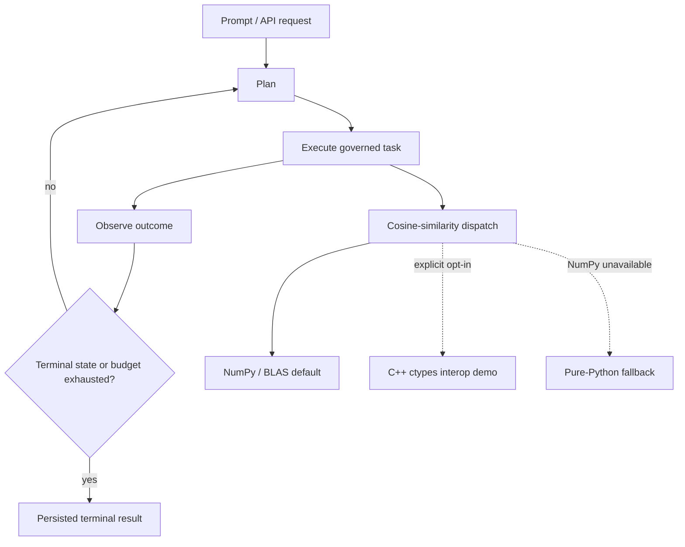

# HelixAgent

<p align="center">
  <strong>Durable autonomous-agent runtime in Python: a bounded plan/execute/observe/replan loop with governed tools, approval gates, and SQLite checkpoints for resumable runs. FastAPI service with Prometheus + OpenTelemetry, NumPy/BLAS vector operations, optional C++ ctypes interop, pure-Python fallback, and reproducible benchmarks.</strong>
</p>

<p align="center">
  <a href="https://github.com/CoreyLeath-code/HelixAgent/actions/workflows/ci-cd.yml"></a>
  <a href="https://github.com/CoreyLeath-code/HelixAgent/actions/workflows/security.yml"></a>
  <a href="https://github.com/CoreyLeath-code/HelixAgent/actions/workflows/release.yml"></a>
  <a href="https://github.com/CoreyLeath-code/HelixAgent/releases"></a>
  <a href="https://github.com/CoreyLeath-code/HelixAgent/blob/main/LICENSE"></a>
  
</p>

<p align="center">
  
  
  
  
  
  
  <a href="https://helixagent-mzekflcbhda4zdchpyhjum.streamlit.app/"></a>
</p>

HelixAgent is a durable Python agent runtime built around a bounded plan/execute/observe/replan loop with governed tools, approval gates, and SQLite checkpoints. Its included planner is deterministic and rule-based; the planner protocol is extensible, but no model provider is implemented. NumPy is the default cosine-similarity backend. The optional C++ ctypes binding is an FFI demonstration, not a performance claim; a scale-stable Python implementation is retained only for NumPy-unavailable environments.

## Features

- **Bounded autonomous execution:** A typed plan/execute/observe/replan loop enforces iteration and tool-call budgets.
- **Deterministic planning and vector backends:** The typed planner protocol uses a rule-based default; NumPy/BLAS is the default vector path, while the opt-in `ctypes` binding demonstrates C++ interop.
- **Resilient fallbacks:** The pure-Python vector implementation is used only if the declared NumPy dependency is unavailable.
- **FastAPI service:** `/`, `/health`, and `/predict` endpoints with generated OpenAPI documentation.
- **Observability:** Prometheus metrics and OpenTelemetry instrumentation are attached to the API.
- **Interactive demo:** A Streamlit interface exercises the same agent runtime.
- **Container delivery:** Multi-stage Docker build, compiled C++ extension, non-root runtime, and container health check.
- **Automated assurance:** Python 3.10/3.11 tests, coverage artifacts, API and Streamlit smoke tests, container validation, CodeQL, Gitleaks, Trivy, dependency auditing, and CycloneDX SBOM generation.
- **Durable autonomy:** Budgeted plan/execute/observe/replan runs, SQLite checkpoints, retries, tool timeouts, explicit approval gates, and resumable run APIs.

## System design flow


```mermaid
flowchart LR
    user["Client or Streamlit user"] --> api["FastAPI service"]
    api --> runtime["Bounded autonomous runtime"]
    runtime --> planner["Rule-based planner\n(typed Planner protocol)"]
    runtime --> registry["Governed tool registry"]
    registry --> gate{"Approval required?"}
    gate -- "yes" --> approval["Explicit operator decision"]
    approval -- "approved" --> tool["Tool execution"]
    approval -- "denied" --> failed["Fail closed and persist result"]
    gate -- "no" --> tool
    runtime --> store["SQLite run checkpoints"]
    api -. "metrics and traces" .-> observability["Prometheus and OpenTelemetry"]
```

Every state transition is owned by the runtime and persisted through the checkpoint store. The
included planner is deterministic and rule-based; a planner protocol exists for extension, but
the repository does not ship a model provider or a distributed scheduler.

## Runtime architecture


```mermaid
flowchart TB
    request["Prompt / API request"] --> plan["Plan"]
    plan --> execute["Execute governed task"]
    execute --> observe["Observe outcome"]
    observe --> replan{"Terminal state or budget exhausted?"}
    replan -- "no" --> plan
    replan -- "yes" --> result["Persisted terminal result"]

    execute --> vector["Cosine-similarity dispatch"]
    vector --> numpy["NumPy / BLAS default"]
    vector -. "explicit opt-in" .-> cpp["C++ ctypes interop demo"]
    vector -. "NumPy unavailable" .-> python["Pure-Python fallback"]
```

The runtime separates policy from mechanism: planners propose typed tasks, the runtime owns
budgets and state transitions, the registry owns tool risk and timeout policy, and the store owns
durability. This keeps a future model planner from bypassing execution invariants.

| Concern | Design decision | Operational tradeoff |
|---|---|---|
| Recovery | Checkpoint every run transition in SQLite | Simple single-node durability; distributed workers require leases and a shared store |
| Safety | Pause write/destructive tools for explicit approval | Safer default with additional operator latency |
| Runaway control | Bound iterations, tool calls, retries, and tool duration | Predictable cost; a valid long task may exhaust its budget |
| Planner extensibility | Typed `Planner` protocol with rule-based default | Credential-free execution; no model provider is implemented |
| Vector interop and fallback | NumPy/BLAS default, optional C++ ctypes binding, Python degradation path | Portable behavior; C++ demonstrates FFI and is not claimed to beat BLAS |

Runtime invariants are covered by tests: terminal states are persisted, denied tools are never
executed, budget exhaustion fails closed, retries are bounded, and timeout responses do not wait
for a slow handler. The database location is configurable with `HELIXAGENT_RUN_DB`; the container
uses the writable non-root path `/app/data/helixagent_runs.db`.

## Research metrics and benchmarks

The benchmark is a deterministic microbenchmark of orchestration plus SQLite checkpoints. It
does **not** include network search, model inference, or provider latency.

### Measurement protocol

- Warm up the process before collecting samples, then run a fixed number of sequential executions.
- Use `time.perf_counter()` for latency measurement and nearest-rank percentiles for p95.
- Create a fresh SQLite database for each invocation and record environment metadata in the JSON output.
- Treat results as local regression evidence only: they are neither service-level objectives nor a claim about concurrent or production capacity.

| Metric | Reference result |
|---|---:|
| Successful runs | 200/200 (100%) |
| End-to-end latency, p50 | 7.798 ms |
| End-to-end latency, p95 | 8.629 ms |
| Checkpoint read latency, p50 | 0.092 ms |
| Checkpoint read latency, p95 | 0.119 ms |
| Sequential throughput | 125.666 runs/s |

Reference environment: Python 3.12.13, Windows 11 build 26200, AMD64; 20 warmups, 200 measured
runs, two deterministic tasks per run, measured July 22, 2026. These are reference observations,
not production SLOs or cross-hardware claims. Reproduce locally with:

```bash
python -m benchmarks.autonomy_runtime --iterations 200 --warmup 20
python -m benchmarks.vector_ops --output vector-ops-results.json
```

See [benchmark methodology and limitations](docs/BENCHMARKS.md) for metric definitions and the
evaluation boundary. CI also uploads a fresh `benchmark-results.json` artifact on Python 3.11.

## Vector-operations benchmark

The vector benchmark measures the NumPy default, the optional C++ ctypes backend when its shared library is present, and the pure-Python implementation. It reports measurements from the machine that runs it; it does not rank backends or claim that C++ outperforms BLAS.

~~~bash
python -m benchmarks.vector_ops --sizes 128 1024 10000 --warmup 10 --repetitions 100 --output vector-ops-results.json
~~~

| Backend | 128 | 1k | 10k |
|---|---|---|---|
| NumPy | <fill after running: python -m benchmarks.vector_ops> | <fill after running: python -m benchmarks.vector_ops> | <fill after running: python -m benchmarks.vector_ops> |
| C++ ctypes (when available) | <fill after running: python -m benchmarks.vector_ops> | <fill after running: python -m benchmarks.vector_ops> | <fill after running: python -m benchmarks.vector_ops> |
| Pure Python | <fill after running: python -m benchmarks.vector_ops> | <fill after running: python -m benchmarks.vector_ops> | <fill after running: python -m benchmarks.vector_ops> |

## Evidence boundaries

The CI matrix exercises Python 3.10 and 3.11 quality/tests, container API health, and Streamlit startup; security and supply-chain workflows run separately. Runtime contract coverage includes terminal-run idempotence, approval gating, bounded retries and budgets, persisted failure for unknown tools, and Python vector fallback properties. The C++ path remains optional and environment-dependent; it is an FFI demonstration rather than a claim of better performance than NumPy.

For the full claim-to-evidence map, invariant definitions, and reproducible statistical primitives, see [claims matrix](docs/CLAIMS_MATRIX.md), [runtime invariants](docs/RUNTIME_INVARIANTS.md), and [evaluation notes](benchmarks/eval/README.md).

## Quick start

Requires Python 3.10 or newer.

```bash
git clone https://github.com/CoreyLeath-code/HelixAgent.git
cd HelixAgent
python -m venv .venv
```

Activate the environment, then install and run the API:

```bash
# macOS/Linux
source .venv/bin/activate
# Windows PowerShell: .venv\Scripts\Activate.ps1
pip install -r requirements.txt
uvicorn api.main:app --reload
```

Open [Swagger UI](http://localhost:8000/docs), or verify the service:

```bash
curl http://localhost:8000/health
curl -X POST http://localhost:8000/predict \
  -H "Content-Type: application/json" \
  -d '{"prompt":"Compare vectors and summarize the result."}'
```

Run the Streamlit demo locally:

```bash
streamlit run streamlit_app.py
```

For an isolated package-build check, use the release gate's packaging path:

```bash
python -m pip install --upgrade build
python -m build
python -m venv .venv-wheel-check
# activate .venv-wheel-check, then:
pip install dist/*.whl
python -c "import agent, api, src; print('wheel import succeeded')"
```

## Test and container workflows

```bash
pip install -r requirements-dev.txt
pytest tests -v --cov=agent --cov=api --cov=src --cov-report=term-missing
ruff check api agent src tests streamlit_app.py
python -m benchmarks.autonomy_runtime --iterations 200 --warmup 20
docker build -t helixagent .
docker run --rm -p 8000:8000 helixagent
```

## Releases and reproducibility

Maintainers create releases by pushing a validated semantic-version tag; the tag workflow
validates the exact commit before it can create a GitHub Release.

~~~bash
git tag -a vX.Y.Z -m "vX.Y.Z"
git push origin vX.Y.Z
~~~

See [release procedure and evidence artifacts](docs/RELEASING.md) for the required
changelog/version update, validation, and reproducibility guidance.

### Reproduce an evidence run

1. Start from a clean checkout and record the commit with `git rev-parse HEAD`.
2. Create a fresh virtual environment and install `requirements-dev.txt`.
3. Run the test, static-analysis, and benchmark commands below without changing the workload.
4. Retain the benchmark JSON output, Python version, operating-system details, and CPU details with the commit SHA.
5. Compare revisions on the same host; report distributions and environment changes rather than treating a single mean as a portability claim.

```bash
pytest tests -v --cov=agent --cov=api --cov=src --cov-report=term-missing
ruff check api agent src tests streamlit_app.py
python -m benchmarks.autonomy_runtime --iterations 200 --warmup 20 > autonomy-results.json
python -m benchmarks.vector_ops --sizes 128 1024 10000 --warmup 10 --repetitions 100 --output vector-ops-results.json
```

## Extended questions and answers

### Is HelixAgent a model-backed agent?

No. The shipped planner is a deterministic, rule-based implementation. The typed planner protocol
is an extension point, not evidence that a model provider is included or evaluated.

### What makes a run durable?

The runtime checkpoints run state in SQLite. A run can be restored by ID, and terminal states are
persisted so a completed run is not executed twice. This is single-node durability, not a
distributed-workflow guarantee.

### How are risky tools governed?

Tools carry risk and timeout policy. A tool that requires approval pauses until an explicit
decision is supplied; a denied action is not executed and its result is persisted.

### What happens when a task runs too long?

Iteration, tool-call, retry, and tool-duration budgets constrain execution. When a bound is
exhausted, the runtime fails closed and records the terminal state rather than continuing
unbounded work.

### Which vector implementation is used by default?

NumPy/BLAS is the default backend. The C++ ctypes path is opt-in and demonstrates safe native
interop; it is not described as a performance replacement for BLAS. Pure Python is used only
when NumPy is unavailable.

### What do the published benchmark numbers prove?

They describe one documented local microbenchmark of deterministic orchestration and SQLite
checkpoints. They exclude external network calls, model inference, concurrent load, and provider
cost; they are not production latency or quality claims.

### How can I verify the repository's release evidence?

Run the reproducibility commands above, inspect the workflow artifacts, and—after a version tag
is validated—compare the GitHub Release's deterministic source archive checksum and CycloneDX
SBOM to the tagged commit.

## Project map

```text
api/                 FastAPI application and monitoring
agent/               Autonomous runtime, planner/tool contracts, and optional C++
src/                 Data and application services
tests/               Unit, API, and data-processing tests
.github/workflows/   CI, security, and release automation
docs/                Engineering and deployment notes
```

## Project status

HelixAgent is an engineering portfolio project and reference implementation, not a managed commercial AI platform. The repository focuses on modularity, graceful degradation, observable services, automated validation, and secure delivery.

See [Autonomous runtime](docs/AUTONOMY.md), [Security](SECURITY.md), [Contributing](CONTRIBUTING.md), [Changelog](CHANGELOG.md), and [deployment hygiene](docs/L6_DEPLOYMENT_HYGIENE.md).
