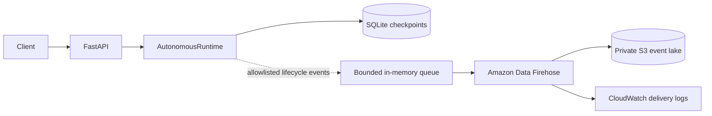

# AWS agent event lake

HelixAgent can optionally mirror redacted autonomous-runtime lifecycle metadata to Amazon Data Firehose for buffered delivery into Amazon S3. SQLite remains the authoritative checkpoint store for resumability; the AWS path is an operational audit/analytics mirror and is not part of run correctness.

## Data flow



## Exported event types

The current schema emits operational metadata for:

- `run.submitted`, `run.started`, `run.resumed`, `run.completed`, `run.failed`, `run.budget_exhausted`
- `plan.created`
- `task.started`, `task.completed`, `task.retry`, `task.failed`
- `approval.requested`, `approval.approved`, `approval.denied`

`run.started` is emitted only for the initial execution. When an approved run continues after an approval pause, the runtime emits `run.resumed` instead, preserving unambiguous lifecycle counts.

The `AgentEvent` schema intentionally excludes raw objectives, tool arguments, observation outputs, approval reasons, and final outputs. Event records may contain run/task IDs, tool name, risk level, status, attempt counts, iteration/tool-call counters, plan size, duration, and timestamps.

## Producer behavior

Set:

```bash
HELIXAGENT_EVENT_SINK=firehose
HELIXAGENT_FIREHOSE_STREAM=helixagent-agent-events
AWS_DEFAULT_REGION=us-east-1
```

Optional producer controls:

```bash
HELIXAGENT_FIREHOSE_QUEUE_SIZE=1000
HELIXAGENT_FIREHOSE_BATCH_SIZE=100
HELIXAGENT_FIREHOSE_FLUSH_SECONDS=1.0
```

The producer uses a bounded in-memory queue and `PutRecordBatch`. Records are newline-delimited JSON. The configured batch size is constrained to 1–500 records, matching the Firehose batch API ceiling. Queue pressure, partial delivery failures, and SDK exceptions are surfaced through metrics but do not fail the autonomous run.

Producer metrics:

```text
helixagent_firehose_records_total{status="queued|delivered|error|dropped"}
helixagent_firehose_batch_size
helixagent_firehose_queue_depth
helixagent_firehose_delivery_seconds
```

Because this is a best-effort mirror, process termination can lose queued events and SDK retries can produce duplicates. Consumers must not treat S3 as the transactional checkpoint database.

## Terraform

The isolated module lives in `infra/aws-event-lake/` and defines:

- private S3 bucket with public-access blocking
- S3 versioning
- SSE-S3 encryption
- configurable current/noncurrent object retention
- Amazon Data Firehose direct-put stream
- GZIP S3 delivery with time-partitioned prefixes
- CloudWatch delivery logs
- Firehose service role with S3/log delivery permissions
- least-privilege writer IAM policy containing only `firehose:PutRecord` and `firehose:PutRecordBatch`

Validate without AWS credentials:

```bash
cd infra/aws-event-lake
terraform fmt -check -recursive
terraform init -backend=false
terraform validate
```

A real deployment requires AWS credentials and will create billable resources:

```bash
terraform plan
terraform apply
```

After apply, attach the `agent_event_writer_policy_arn` output to the runtime workload identity. Prefer temporary role credentials such as an EKS workload identity instead of long-lived access keys.

## S3 object layout

Successful delivery uses:

```text
events/year=YYYY/month=MM/day=DD/hour=HH/
```

Firehose delivery failures use:

```text
errors/<firehose-error-type>/year=YYYY/month=MM/day=DD/hour=HH/
```

Objects are GZIP compressed. Firehose buffers before S3 delivery; the Terraform defaults are 5 MiB or 60 seconds, whichever condition is satisfied first.

## Validation boundary

Pull-request CI performs unit tests against a fake Firehose client and validates Terraform formatting/provider configuration. It does **not** execute `terraform apply`, provision AWS resources, prove live Firehose-to-S3 delivery, or benchmark cloud throughput/durability.

A future live-AWS integration test should use disposable infrastructure and retain exact command, region, commit SHA, event count, delivery latency, and cleanup evidence before adding any live-delivery performance claim.
